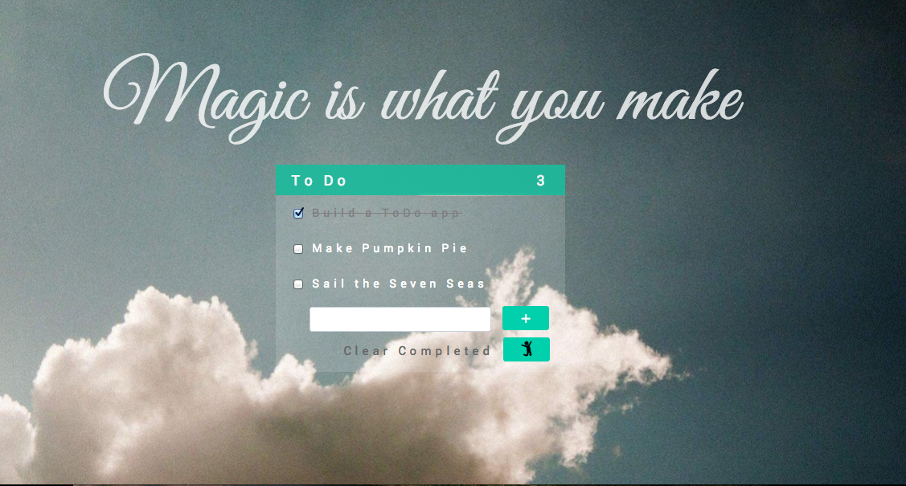

#ToDo List

A simple to do list build using AngularJs, HTML & CSS



####Deployed
To view, visit:

###Objectives

- Experiment with AngularJs

###Specifications

+ Users can add as many tasks as they like
+ Users can remove completed tasks
+ Total Todo figure dynamically updates

###Set up

```sh
git clone https://github.com/csharpd/todo_angularjs.git
cd todo
bundle install
```

### Enhancments
Do a TDD rewrite

